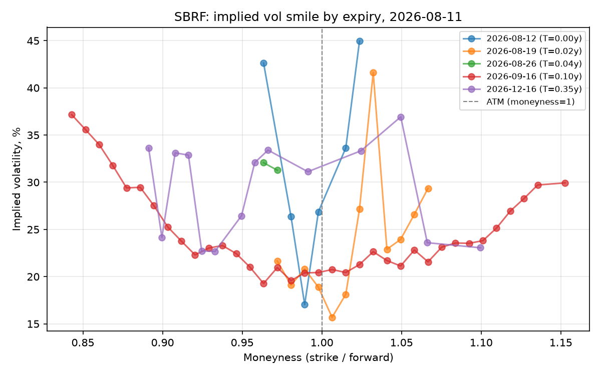

# moex-options

Black-76 option pricing and Greeks implemented from scratch, an implied-vol
solver (Newton-Raphson with a bisection fallback), and a volatility smile/
surface built from the **real, live** MOEX FORTS options market — not a
backtest, a snapshot of what's quoted right now.

## What's actually here

1. **`black76.py`** — pricing and Greeks for options on a futures/forward
   underlying. Deliberately Black-76, not vanilla Black-Scholes-Merton — see
   below.
2. **`implied_vol.py`** — inverts Black-76 by Newton-Raphson (fast, uses
   vega), falling back to bisection (slower, guaranteed convergent given a
   bracket) when Newton stalls or steps out of a sane range — the standard
   robust-solver pattern, needed because far-OTM/short-dated options have
   near-zero vega and can make plain Newton diverge.
3. **`chain.py`** — fetches today's full option chain and the underlying
   futures quotes from MOEX ISS in two requests, live (not historical — see
   below for why).
4. **`surface.py`** — turns a chain snapshot into a tidy implied-vol
   surface: one row per contract, with an OTM-only filter (`select_otm`)
   for building a clean smile.

## Why Black-76, not textbook Black-Scholes-Merton

FORTS options are options *on a futures contract*, not on spot. Pricing
those by plugging the futures price into vanilla BSM (`S = F`, no further
adjustment) is a specific, common mistake: it discounts the strike leg by
`exp(-rT)` but leaves the forward leg undiscounted —
`F*N(d1) - K*exp(-rT)*N(d2)` instead of the correct
`exp(-rT)*(F*N(d1) - K*N(d2))`. Black-76 discounts the whole payoff
uniformly, which is what's actually right here. `test_black76.py` checks
this isn't just asserted but true: put-call parity holds exactly, and
`delta_call - delta_put` equals the discount factor exactly, both
consequences of getting the discounting right.

## Why this fetches a *live snapshot*, not a historical time series

MOEX's free ISS access gives live bid/offer for FORTS options, but not
historical ones (`moex-backtest`'s data notes cover the same limitation).
A vol surface built over years of history isn't available this way — so
this project builds today's full strike/maturity grid instead, which the
data actually supports. `MoexOptionsChainClient.fetch_chain` does this in
two ISS calls (options reference+marketdata, futures reference+marketdata),
filtered to one underlying asset.

## Two real bugs found by actually running it, not assumed away

1. **MOEX runs two parallel option series per underlying stock at different
   strike scales** — one struck on the futures price directly
   (`SBRF-9.26M160926CA29000`, strike ~29000) and one closer to the
   per-share price (`SBERP160926CE210`, strike ~210). Mixing them into one
   forward-vs-strike comparison would silently corrupt the surface.
   `chain.py`'s parser only matches the futures-scaled family and counts
   (not silently drops) everything else.
2. **A monthly option series and several weekly series share the same
   underlying futures label.** First-draft code grouped the surface by
   that label for plotting, which produced a visibly jagged, wrong-looking
   "smile" — really 5 different maturities plotted as one line. Fixed by
   grouping by actual expiry date instead; caught by looking at the
   real output, not by a unit test (a good reminder that integration
   with real data surfaces bugs unit tests on synthetic data can't).

## A third issue, not a bug — real market microstructure noise

Even after fixing both of the above, the smile was still jagged near the
money. Cause: at the same strike, a put's mid-price and a call's mid-price
don't imply exactly the same vol once real bid/offer spreads are in the
picture, and one side is usually deep in-the-money (price dominated by
intrinsic value, wide effective noise) while the other is out-of-the-money
(price is mostly time value, much more informative). `select_otm` keeps
only the OTM (or ATM) side per strike — standard market practice, not a
cosmetic choice — which is what actually produces a clean smile.

## Real results, right now (2026-08-11, SBRF market open)

88 live, liquid contracts found (out of ~1,832 SBRF-asset names in the
full options market — the rest are either the other strike scale or have
no live bid/offer at all). 70 remain after the OTM filter, across 5
distinct expiries from tomorrow (2026-08-12) out to 2026-12-16.

The **September monthly series** (36 contracts, by far the deepest
liquidity) produces a clean, textbook skew: implied vol around 30% for
deep OTM puts, down to ~19-20% near the money, curving back up slightly on
the OTM call side. The **tomorrow-expiring weekly series** is visibly
noisier — not a bug: a 1-day option's price is almost pure bid/offer
spread relative to its near-zero time value, so its implied vol is
genuinely less informative, not just under-processed.



```bash
uv run python scripts/run_demo.py
```

writes `reports/assets/vol_smile.png` and prints the near-the-money strip
of every expiry found live.

## Installation & usage

Requires Python 3.12+ and [uv](https://docs.astral.sh/uv/). Standalone —
does not depend on `moex-backtest` (this project isn't a trading strategy;
pricing/surface construction doesn't need a backtest engine).

```bash
uv sync
uv run python scripts/run_demo.py   # needs MOEX FORTS trading hours for live quotes
uv run pytest                        # 38 tests, all HTTP mocked — no network needed
uv run ruff check . && uv run mypy src tests
```

## Roadmap

- Fetch RUONIA (or another real short-rate series) instead of the flat
  `RISK_FREE_RATE` assumption.
- A parametric smile fit (SVI or similar) over the OTM points, for a
  smoother surface between observed strikes than raw scatter.
- Feed the fitted surface into `moex-cvar-portfolio` as an options overlay,
  or use it to price a simple variance swap replication.
